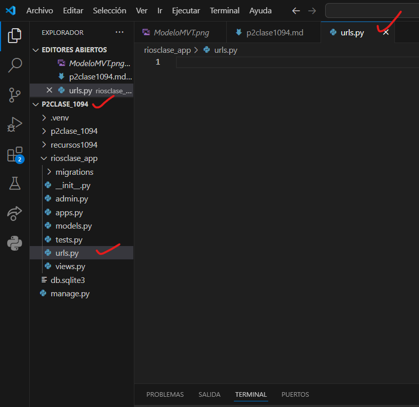
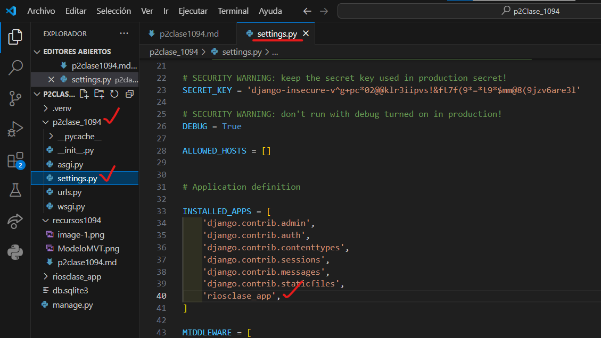
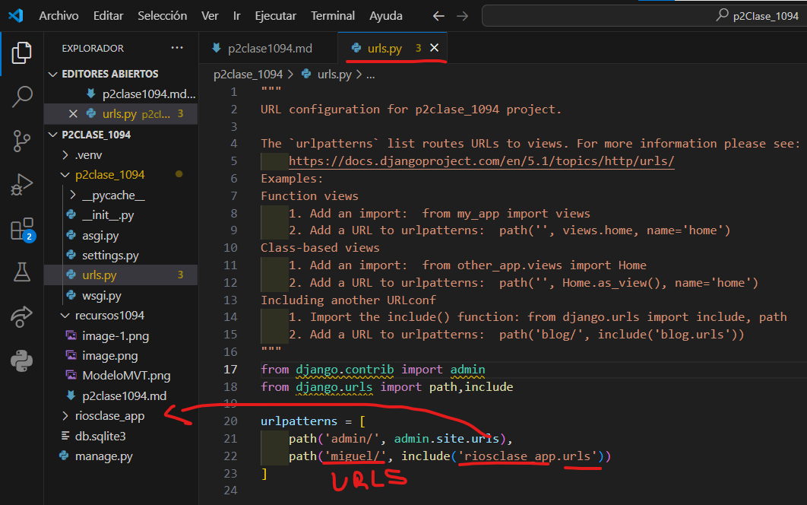
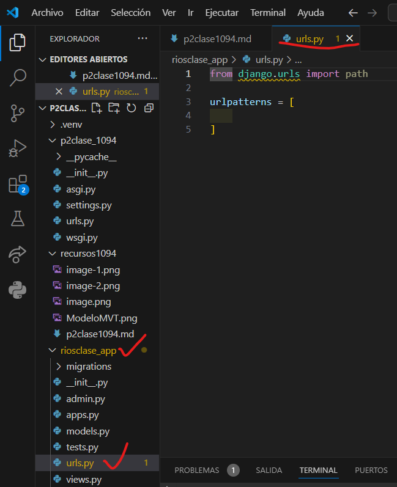
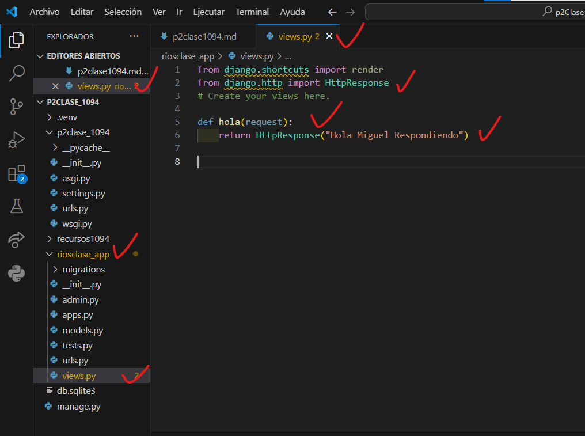
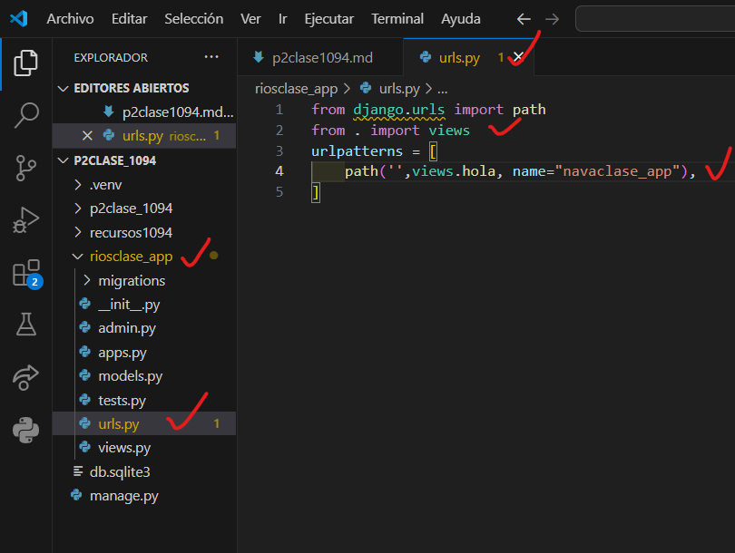

- Crear aplicacion riosclase_app
- Comando --> python manage.py startapp riosclase_app
- Creamos el archivo urls.py en riosclase_app
- 
- En setting.py de p2clase_1094
- 
- En urls.py de p2clase_1094
- 
- En urls.py en riosclase_app
- 
- en views.py en riosclase_app
- 
- en urls riosclase_app
- 